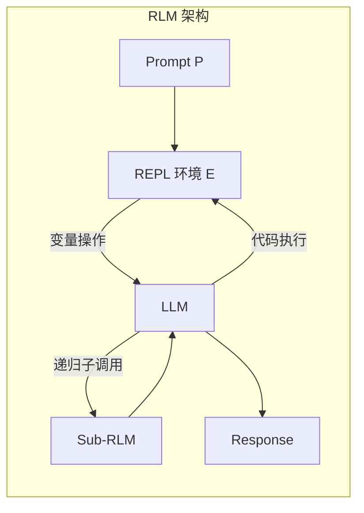
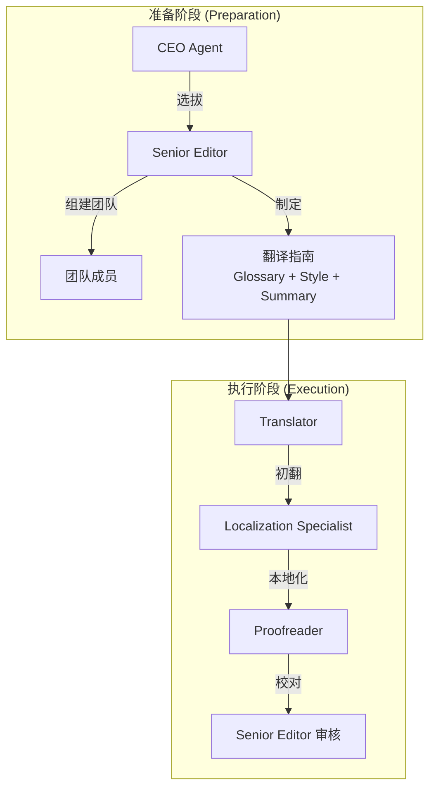

# DeepTrans-RLM 开发规范 (Development Specification)

> 本规范基于 [prd.md](./prd.md) 及核心论文制定，旨在为项目开发提供统一的技术标准和最佳实践指南。
>
> **核心论文参考**：
> - [TransAgents](./2405.11804v2.pdf): 多 Agent 文学翻译协作框架
> - [RLM](./2512.24601v1.pdf): 递归语言模型 - 将长上下文作为环境变量处理

---

## 1. 核心理论基础 (Theoretical Foundations)

### 1.1 RLM (Recursive Language Models) 范式

> [!NOTE]
> RLM 的核心洞察：**长 Prompt 不应直接喂入神经网络，而应作为环境的一部分让 LLM 以符号方式交互**。



**RLM 核心设计原则**：

| 原则 | 描述 | 实现方式 |
| :--- | :--- | :--- |
| **Prompt-as-Variable** | Prompt 作为 REPL 环境中的变量 | 使用 `context_var` 存储完整文本 |
| **Selective Viewing** | 按需查看上下文片段 | 代码驱动的切片访问 |
| **Recursive Sub-calling** | 递归分解复杂任务 | Sub-LM 处理子任务后回传结果 |
| **Code-driven Filtering** | 利用模型先验知识过滤信息 | 正则/关键词搜索缩小范围 |

**RLM 在翻译中的应用**：
```python
# RLM 风格的上下文管理
class RLMContext:
    """将原文作为环境变量管理，而非直接注入 LLM 上下文"""
    
    def __init__(self, full_text: str):
        self.full_text = full_text  # 完整文本作为变量
        self.metadata = self._extract_metadata()
        
    def peek(self, start: int, end: int) -> str:
        """按需查看文本片段（Selective Viewing）"""
        return self.full_text[start:end]
        
    def search(self, pattern: str) -> List[tuple]:
        """基于模型先验的关键词搜索（Code-driven Filtering）"""
        import re
        return [(m.start(), m.end()) for m in re.finditer(pattern, self.full_text)]
        
    def chunk_and_delegate(self, chunks: List[str], sub_task: Callable) -> List[str]:
        """分块并递归子调用（Recursive Sub-calling）"""
        return [sub_task(chunk) for chunk in chunks]
```

### 1.2 TransAgents 多 Agent 协作模式

> [!NOTE]
> TransAgents 模拟人类翻译公司的最佳实践，通过角色分工和 **Addition-by-Subtraction** 策略提升翻译质量。

**两阶段工作流**：



**Addition-by-Subtraction 协作算法**：

```python
def addition_by_subtraction(
    addition_agent: Agent,    # 生成详尽内容
    subtraction_agent: Agent, # 精简冗余信息
    conversation_history: List[str],
    max_iterations: int = 2
) -> str:
    """
    两 Agent 迭代协作：
    1. Addition Agent 产出全面内容
    2. Subtraction Agent 审查并移除冗余
    3. 迭代直到无进一步修订或达到最大轮次
    
    关键特性：Early Exit - 若连续两轮输出相同则提前终止
    """
    response = ""
    for m in range(max_iterations):
        new_response = addition_agent.generate(conversation_history)
        feedback = subtraction_agent.review(conversation_history, new_response)
        conversation_history.extend([new_response, feedback])
        
        if new_response == response:  # Early exit
            break
        response = new_response
        
    return response
```

### 1.3 长期记忆管理 (Long-Term Memory)

根据 TransAgents 论文，记忆分为两类：

| 类型 | 范围 | 内容 | 实现 |
| :--- | :--- | :--- | :--- |
| **短期记忆** | 当前对话 | 当前块的上下文 | Prompt 中直接注入 |
| **长期记忆** | 全书范围 | Glossary, Summary, Character Profiles | `TranslationState` 全局变量 |

**翻译指南 (Translation Guidelines)** 构成：
1. **Glossary**: 专有名词/术语映射
2. **Book Summary**: 全书剧情概要
3. **Tone & Style**: 风格定调
4. **Target Audience**: 目标读者

---

## 2. 项目结构规范 (Project Structure)

```
RLM-Translate/
├── doc/                          # 文档目录
│   ├── prd.md                    # 产品需求文档
│   ├── spec.md                   # 开发规范文档 (本文件)
│   ├── 2405.11804v2.pdf          # TransAgents 论文
│   └── 2512.24601v1.pdf          # RLM 论文
├── src/                          # 源代码目录
│   ├── __init__.py
│   ├── core/                     # 核心模块
│   │   ├── __init__.py
│   │   ├── state.py              # TranslationState 定义
│   │   ├── rlm_context.py        # RLM 上下文管理器
│   │   ├── chunker.py            # 文本切分逻辑
│   │   └── client.py             # LLM 客户端封装
│   ├── agents/                   # Agent 模块
│   │   ├── __init__.py
│   │   ├── drafter.py            # 初翻 Agent (Addition)
│   │   ├── critic.py             # 评审 Agent (Subtraction)
│   │   ├── editor.py             # 润色 Agent
│   │   └── collaboration.py      # Addition-by-Subtraction 协作
│   ├── memory/                   # 记忆管理模块
│   │   ├── __init__.py
│   │   ├── short_term.py         # 短期记忆（对话上下文）
│   │   └── long_term.py          # 长期记忆（Glossary, Summary）
│   ├── graphs/                   # LangGraph 工作流
│   │   ├── __init__.py
│   │   ├── main_graph.py         # 主图 (RLM 控制层)
│   │   └── translation_subgraph.py # 翻译子图 (Agent 协作层)
│   └── utils/                    # 工具函数
│       ├── __init__.py
│       ├── tokenizer.py          # Token 计数工具
│       └── file_handler.py       # 文件处理工具
├── prompts/                      # Prompt 模板目录
│   ├── analyzer.txt              # 术语提取 Prompt
│   ├── drafter.txt               # 初翻 Prompt
│   ├── critic.txt                # 评审 Prompt (Subtraction)
│   └── editor.txt                # 润色 Prompt
├── config/                       # 配置目录
│   ├── settings.yaml             # 全局配置
│   └── models.yaml               # 模型配置
├── tests/                        # 测试目录
│   ├── unit/                     # 单元测试
│   └── integration/              # 集成测试
├── scripts/                      # 脚本目录
│   └── run_translation.py        # 入口脚本
├── requirements.txt              # 依赖列表
├── pyproject.toml                # 项目配置
└── README.md                     # 项目说明
```

---

## 3. 状态管理规范 (State Management)

### 3.1 TranslationState 定义

```python
from typing import TypedDict, List, Dict, Optional

class TranslationState(TypedDict, total=False):
    """全局翻译状态，贯穿整个工作流生命周期。
    
    基于 RLM 范式：将长文本作为环境变量，而非直接注入上下文。
    基于 TransAgents：维护长期记忆（Glossary, Summary）确保一致性。
    """
    
    # === RLM 环境变量 (Prompt-as-Variable) ===
    raw_text: str                    # 完整原文（作为环境变量，按需访问）
    raw_text_length: int             # 原文长度（Token 计数）
    
    # === 长期记忆 (Long-Term Memory - TransAgents) ===
    glossary: Dict[str, str]         # 术语表 {原文: 译文}
    style_guide: str                 # 风格指南
    plot_summary: List[str]          # 剧情摘要链 (递增)
    character_profiles: Dict[str, str]  # 角色状态
    book_summary: str                # 全书概要
    target_audience: str             # 目标读者
    
    # === 运行时变量 (循环控制) ===
    chapter_map: List[Dict[str, any]]  # 章节映射表
    total_chunks: int                   # 总任务块数
    current_chunk_index: int            # 当前处理索引
    current_source_text: str            # 当前待处理文本块（RLM peek结果）
    
    # === Agent 协作区 (Addition-by-Subtraction) ===
    draft_translation: str           # Addition Agent 初稿
    critique_comments: str           # Subtraction Agent 反馈
    iteration_count: int             # 当前协作迭代次数
    final_chunk_translation: str     # 当前块定稿
    
    # === 输出结果 ===
    completed_translations: List[str]  # 已完成译文列表
```

### 3.2 RLM 风格的状态更新

> [!IMPORTANT]
> **不可变更新 + RLM 变量分离**：长文本保持在环境变量中，只传递元数据和当前处理片段。

```python
# ✅ RLM 风格：按需访问长文本，不直接传递
def peek_current_chunk(state: TranslationState) -> TranslationState:
    """RLM Selective Viewing: 只查看当前需要的文本片段"""
    chunk_info = state["chapter_map"][state["current_chunk_index"]]
    current_text = state["raw_text"][chunk_info["start"]:chunk_info["end"]]
    
    return {
        **state,
        "current_source_text": current_text  # 只传递当前块
    }

# ✅ 长期记忆更新：追加而非覆盖
def append_plot_summary(state: TranslationState, new_summary: str) -> TranslationState:
    """TransAgents 风格：累积剧情摘要"""
    return {
        **state,
        "plot_summary": [*state["plot_summary"], new_summary]
    }
```

---

## 4. LLM 调用规范 (LLM Integration)

### 4.1 模型配置 (基于 PRD 最新要求)

```yaml
# config/models.yaml
models:
  # --- 主力模型 (Gemini 3 系列) ---
  analyzer:
    name: gemini-3-pro
    temperature: 1.0
    purpose: "全书扫描，术语/人物/剧情提取"
    context_window: 2000000  # 2M+ tokens
    
  drafter:
    name: gemini-3-flash
    temperature: 1.0
    purpose: "高速初翻 (Addition Agent)"
    
  critic:
    name: gemini-3-pro
    temperature: 1.0
    purpose: "深度审查 (Subtraction Agent)"
    
  editor:
    name: gemini-3-flash
    temperature: 1.0
    purpose: "润色定稿"

safety_settings:
  # 文学翻译必须禁用内容过滤
  harassment: BLOCK_NONE
  hate_speech: BLOCK_NONE
  sexually_explicit: BLOCK_NONE
  dangerous_content: BLOCK_NONE
```

### 4.2 Token 阈值规范 (基于 PRD 更新)

| 参数 | 值 | 说明 |
| :--- | :--- | :--- |
| `MAX_OUTPUT_TOKENS` | ~21,000 | Gemini 3 输出安全上限 |
| `SOURCE_CHUNK_THRESHOLD` | 200,000 | 以章节为单位，不超过 200K Tokens |
| `CONTEXT_WINDOW` | 2,000,000+ | Gemini 3 Pro 超长上下文窗口 |

### 4.3 客户端封装

```python
# src/core/client.py
from langchain_google_genai import ChatGoogleGenerativeAI
from google.generativeai.types import HarmCategory, HarmBlockThreshold

def create_llm_client(
    model_name: str,
    temperature: float = 1.0,  # PRD 建议 Temperature 1.0
) -> ChatGoogleGenerativeAI:
    """创建配置好安全设置的 LLM 客户端。
    
    基于 PRD v2: 使用 Gemini 3 系列，Temperature 1.0
    """
    safety_settings = {
        HarmCategory.HARM_CATEGORY_HARASSMENT: HarmBlockThreshold.BLOCK_NONE,
        HarmCategory.HARM_CATEGORY_HATE_SPEECH: HarmBlockThreshold.BLOCK_NONE,
        HarmCategory.HARM_CATEGORY_SEXUALLY_EXPLICIT: HarmBlockThreshold.BLOCK_NONE,
        HarmCategory.HARM_CATEGORY_DANGEROUS_CONTENT: HarmBlockThreshold.BLOCK_NONE,
    }
    
    return ChatGoogleGenerativeAI(
        model=model_name,
        temperature=temperature,
        safety_settings=safety_settings,
    )
```

---

## 5. Agent 协作规范 (Agent Collaboration)

### 5.1 角色定义 (基于 TransAgents + PRD)

| 角色 | 模型 | TransAgents 对应 | 核心职责 |
| :--- | :--- | :--- | :--- |
| **Drafter** | Flash | Translator (Addition) | 准确还原语义，遵守术语表，参考剧情摘要 |
| **Critic** | Pro | Proofreader (Subtraction) | 苛刻审查，指出术语背离、文化丢失、语气不连贯 |
| **Editor** | Flash | Localization Specialist | 结合多方意见润色，执行风格指南 |

### 5.2 Addition-by-Subtraction 实现

```python
# src/agents/collaboration.py
from typing import Generator
from .drafter import DrafterAgent
from .critic import CriticAgent

class TranslationCollaboration:
    """基于 TransAgents 的 Addition-by-Subtraction 协作策略"""
    
    MAX_ITERATIONS = 2  # 论文默认最大迭代次数
    
    def __init__(self, drafter: DrafterAgent, critic: CriticAgent):
        self.addition_agent = drafter
        self.subtraction_agent = critic
        
    def translate_with_refinement(
        self, 
        source_text: str,
        context: Dict
    ) -> Generator[str, None, str]:
        """
        执行 Addition-by-Subtraction 翻译协作。
        
        流程:
        1. Addition Agent (Drafter) 产出详尽初稿
        2. Subtraction Agent (Critic) 审查并反馈冗余/错误
        3. 迭代直到收敛或达到最大次数
        
        Yields:
            每轮的中间结果（用于流式展示进度）
            
        Returns:
            最终精炼后的译文
        """
        history = []
        prev_response = ""
        
        for iteration in range(self.MAX_ITERATIONS):
            # Step 1: Addition - 生成详尽翻译
            draft = self.addition_agent.translate(
                source_text, 
                context, 
                history
            )
            yield f"[Iteration {iteration + 1}] Draft: {draft[:100]}..."
            
            # Step 2: Subtraction - 审查并精简
            feedback = self.subtraction_agent.critique(
                source_text, 
                draft, 
                context
            )
            yield f"[Iteration {iteration + 1}] Feedback: {feedback[:100]}..."
            
            history.extend([draft, feedback])
            
            # Early Exit: 若无进一步修改建议
            if draft == prev_response or "no further changes" in feedback.lower():
                break
                
            prev_response = draft
            
        return prev_response
```

### 5.3 长期记忆注入规范

```python
def inject_long_term_memory(prompt_template: str, state: TranslationState) -> str:
    """
    TransAgents 风格：将长期记忆（Glossary, Summary, Style）注入 Prompt
    
    关键：充分利用 Gemini 2M+ 窗口，注入前 5-10 章详细摘要
    """
    # 术语表（强制全局传递）
    glossary_section = "\n".join(
        f"- {term} → {translation}" 
        for term, translation in state["glossary"].items()
    )
    
    # 剧情摘要（取最近 5-10 章）
    recent_summaries = state["plot_summary"][-10:]
    summary_section = "\n".join(recent_summaries)
    
    return prompt_template.format(
        glossary=glossary_section,
        plot_summary=summary_section,
        style_guide=state["style_guide"],
        target_audience=state.get("target_audience", "一般读者"),
        book_summary=state.get("book_summary", ""),
    )
```

---

## 6. 代码规范 (Coding Standards)

### 6.1 Python 版本与风格

| 项目 | 规范 |
| :--- | :--- |
| **Python 版本** | >= 3.10 (支持 TypedDict 完整语法) |
| **代码风格** | PEP 8 + Black 格式化 (line-length: 100) |
| **类型标注** | 强制使用 Type Hints，配合 `mypy` 静态检查 |
| **导入顺序** | 标准库 → 第三方库 → 本地模块，使用 `isort` 自动排序 |

### 6.2 命名规范

```python
# 模块/文件名：snake_case
translation_subgraph.py
rlm_context.py

# 类名：PascalCase
class TranslationState:
    pass

class RLMContext:
    pass

# 函数/方法名：snake_case
def plan_chunks(text: str) -> List[str]:
    pass

def peek_context(start: int, end: int) -> str:
    pass

# 常量：UPPER_SNAKE_CASE
MAX_OUTPUT_TOKENS = 21000
DEFAULT_TEMPERATURE = 1.0

# 私有成员：前缀下划线
def _internal_helper():
    pass
```

---

## 7. Prompt 工程规范 (Prompt Engineering)

### 7.1 TransAgents 风格 Prompt 模板

```jinja2
{# prompts/drafter.txt - Addition Agent #}
# Role: Expert Literary Translator (Addition Agent)

You are translating from {{ source_lang }} to {{ target_lang }}.
Your goal is to produce a comprehensive, detailed translation.

## Translation Guidelines (Long-Term Memory)

### Glossary (MUST follow exactly)
{{ glossary }}

### Book Summary
{{ book_summary }}

### Recent Plot Context (Last 5-10 chapters)
{{ plot_summary }}

### Style Guide
{{ style_guide }}

### Target Audience
{{ target_audience }}

## Source Text
{{ current_source_text }}

## Instructions
1. Translate the ENTIRE source text faithfully - do not summarize.
2. Strictly follow the glossary mappings above.
3. Maintain consistency with the plot context.
4. Preserve the author's writing style, tone, and cultural nuances.
5. Err on the side of more detail rather than less (Addition principle).

## Output
Provide ONLY the translated text, no explanations.
```

```jinja2
{# prompts/critic.txt - Subtraction Agent #}
# Role: Senior Editor (Subtraction Agent)

You are reviewing a translation from {{ source_lang }} to {{ target_lang }}.
Your role is to identify and remove redundant, inaccurate, or inconsistent content.

## Translation Guidelines Reference
{{ glossary }}

## Draft Translation to Review
{{ draft_translation }}

## Original Source Text
{{ current_source_text }}

## Review Criteria
1. **Glossary Compliance**: Flag any deviations from the glossary
2. **Redundancy**: Identify verbose or repetitive passages
3. **Cultural Fidelity**: Check for lost cultural nuances
4. **Tone Consistency**: Verify consistent character voices
5. **Accuracy**: Identify mistranslations or omissions

## Output Format
Provide specific, actionable feedback. If no changes needed, respond with:
"No further changes required."
```

---

## 8. 错误处理规范 (Error Handling)

### 8.1 自定义异常

```python
# src/core/exceptions.py

class TranslationError(Exception):
    """翻译流程基础异常"""
    pass

class TokenLimitExceeded(TranslationError):
    """Token 超限异常"""
    def __init__(self, chunk_index: int, token_count: int, limit: int):
        self.chunk_index = chunk_index
        self.token_count = token_count
        self.limit = limit
        super().__init__(
            f"Chunk {chunk_index} exceeds token limit: {token_count} > {limit}"
        )

class GlossaryViolation(TranslationError):
    """术语表违规异常"""
    def __init__(self, term: str, expected: str, actual: str):
        self.term = term
        self.expected = expected
        self.actual = actual
        super().__init__(
            f"Glossary violation: '{term}' should be '{expected}', got '{actual}'"
        )

class RLMContextError(TranslationError):
    """RLM 上下文操作异常"""
    pass

class CollaborationConvergenceError(TranslationError):
    """Addition-by-Subtraction 协作未收敛"""
    pass

class APIRateLimitError(TranslationError):
    """API 限流异常"""
    pass
```

### 8.2 重试策略

```python
from tenacity import retry, stop_after_attempt, wait_exponential, retry_if_exception_type

@retry(
    stop=stop_after_attempt(3),
    wait=wait_exponential(multiplier=1, min=4, max=60),
    retry=retry_if_exception_type(APIRateLimitError)
)
async def call_llm_with_retry(client, prompt: str) -> str:
    """带重试机制的 LLM 调用"""
    try:
        response = await client.ainvoke(prompt)
        return response.content
    except Exception as e:
        if "rate limit" in str(e).lower():
            raise APIRateLimitError(str(e))
        raise
```

---

## 9. 测试规范 (Testing Standards)

### 9.1 测试覆盖要求

| 模块 | 最低覆盖率 | 重点测试项 |
| :--- | :---: | :--- |
| `core/rlm_context.py` | 90% | peek/search/chunk 操作、边界条件 |
| `core/chunker.py` | 90% | Token 边界、章节切分、异常输入 |
| `agents/collaboration.py` | 85% | Early Exit、迭代收敛、状态同步 |
| `memory/*` | 85% | 长期记忆持久化、Glossary 一致性 |
| `graphs/*` | 75% | 流程流转、条件分支 |

### 9.2 协作测试示例

```python
# tests/unit/test_collaboration.py
import pytest
from src.agents.collaboration import TranslationCollaboration

class TestAdditionBySubtraction:
    def test_early_exit_on_convergence(self):
        """Early Exit: 若两轮输出相同则提前终止"""
        collab = TranslationCollaboration(mock_drafter, mock_critic)
        result = list(collab.translate_with_refinement(
            "Test source", 
            {"glossary": {}}
        ))
        # 验证迭代次数 < MAX_ITERATIONS
        assert len(result) <= 4  # 2 iterations * 2 yields each
        
    def test_glossary_enforcement(self):
        """Critic 应检测术语违规"""
        collab = TranslationCollaboration(mock_drafter, strict_critic)
        result = collab.translate_with_refinement(
            "The Ring of Power",
            {"glossary": {"Ring of Power": "至尊魔戒"}}
        )
        assert "至尊魔戒" in result
```

---

## 10. 日志规范 (Logging Standards)

| 级别 | 使用场景 |
| :--- | :--- |
| `DEBUG` | Token 计数、RLM peek 操作、Prompt 内容 |
| `INFO` | 章节处理进度、Agent 切换、协作迭代 |
| `WARNING` | 接近 Token 限制、协作未收敛、重试 |
| `ERROR` | API 错误、术语违规、RLM 上下文错误 |
| `CRITICAL` | 流程中断、全局状态损坏 |

---

## 11. 调试与 Debug 规范 (Debugging Standards)

### 11.1 调试环境配置

```yaml
# config/settings.yaml - 调试模式配置
debug:
  enabled: true                    # 启用调试模式
  save_prompts: true               # 保存所有 Prompt 到文件
  save_responses: true             # 保存所有 LLM 响应
  snapshot_interval: 1             # 每处理 N 个块保存状态快照
  verbose_logging: true            # 启用详细日志
  dry_run: false                   # 干跑模式（不实际调用 LLM）
  
output:
  debug_dir: "./debug_output"      # 调试输出目录
  prompt_dir: "./debug_output/prompts"
  response_dir: "./debug_output/responses"
  snapshot_dir: "./debug_output/snapshots"
```

### 11.2 调试工具集成

```python
# src/utils/debugger.py
import json
from datetime import datetime
from pathlib import Path
from typing import Any, Dict, Optional

class TranslationDebugger:
    """翻译流程调试器"""
    
    def __init__(self, config: Dict, enabled: bool = True):
        self.enabled = enabled
        self.config = config
        self.debug_dir = Path(config.get("debug_dir", "./debug_output"))
        self.debug_dir.mkdir(parents=True, exist_ok=True)
        self._session_id = datetime.now().strftime("%Y%m%d_%H%M%S")
        
    def save_prompt(
        self, 
        agent_name: str, 
        prompt: str, 
        chunk_index: int,
        iteration: int = 0
    ) -> Optional[Path]:
        """保存 Prompt 到文件用于调试"""
        if not self.enabled:
            return None
            
        filename = f"{self._session_id}_{agent_name}_chunk{chunk_index:03d}_iter{iteration}.txt"
        filepath = self.debug_dir / "prompts" / filename
        filepath.parent.mkdir(parents=True, exist_ok=True)
        filepath.write_text(prompt, encoding="utf-8")
        return filepath
        
    def save_response(
        self,
        agent_name: str,
        response: str,
        chunk_index: int,
        iteration: int = 0,
        metadata: Optional[Dict] = None
    ) -> Optional[Path]:
        """保存 LLM 响应到文件"""
        if not self.enabled:
            return None
            
        data = {
            "agent": agent_name,
            "chunk_index": chunk_index,
            "iteration": iteration,
            "timestamp": datetime.now().isoformat(),
            "response": response,
            "metadata": metadata or {}
        }
        
        filename = f"{self._session_id}_{agent_name}_chunk{chunk_index:03d}_iter{iteration}.json"
        filepath = self.debug_dir / "responses" / filename
        filepath.parent.mkdir(parents=True, exist_ok=True)
        filepath.write_text(json.dumps(data, ensure_ascii=False, indent=2), encoding="utf-8")
        return filepath
        
    def save_state_snapshot(
        self, 
        state: Dict, 
        label: str = ""
    ) -> Optional[Path]:
        """保存状态快照用于断点恢复"""
        if not self.enabled:
            return None
            
        # 排除大型字段避免快照过大
        snapshot = {
            k: v for k, v in state.items() 
            if k not in ["raw_text", "completed_translations"]
        }
        snapshot["_snapshot_time"] = datetime.now().isoformat()
        snapshot["_label"] = label
        
        filename = f"{self._session_id}_snapshot_{label}.json"
        filepath = self.debug_dir / "snapshots" / filename
        filepath.parent.mkdir(parents=True, exist_ok=True)
        filepath.write_text(json.dumps(snapshot, ensure_ascii=False, indent=2), encoding="utf-8")
        return filepath
```

### 11.3 LLM 调用调试

> [!TIP]
> 使用 `LangSmith` 进行完整的 LLM 调用链追踪。

```python
# src/core/client.py - 调试增强版
import os
from langchain.callbacks import tracing_v2_enabled

def create_debug_client(
    model_name: str,
    temperature: float = 1.0,
    trace_name: str = "translation_debug"
) -> ChatGoogleGenerativeAI:
    """创建带调试追踪的 LLM 客户端"""
    
    # 启用 LangSmith 追踪
    os.environ["LANGCHAIN_TRACING_V2"] = "true"
    os.environ["LANGCHAIN_PROJECT"] = trace_name
    
    client = create_llm_client(model_name, temperature)
    return client

# 使用示例
async def debug_llm_call(client, prompt: str, debugger: TranslationDebugger):
    """带完整调试信息的 LLM 调用"""
    import time
    
    start_time = time.time()
    
    try:
        with tracing_v2_enabled():
            response = await client.ainvoke(prompt)
            
        elapsed = time.time() - start_time
        
        # 记录调试信息
        debugger.save_response(
            agent_name="llm_call",
            response=response.content,
            chunk_index=0,
            metadata={
                "elapsed_seconds": elapsed,
                "model": client.model_name,
                "token_usage": getattr(response, "usage_metadata", {}),
            }
        )
        
        return response.content
        
    except Exception as e:
        debugger.save_response(
            agent_name="llm_call_error",
            response=str(e),
            chunk_index=0,
            metadata={"error_type": type(e).__name__}
        )
        raise
```

### 11.4 断点与状态恢复

```python
# src/utils/checkpoint.py
from pathlib import Path
from typing import Optional
import json

class CheckpointManager:
    """支持断点续传的检查点管理器"""
    
    def __init__(self, checkpoint_dir: Path):
        self.checkpoint_dir = checkpoint_dir
        self.checkpoint_dir.mkdir(parents=True, exist_ok=True)
        
    def save_checkpoint(
        self, 
        state: Dict, 
        checkpoint_name: str = "latest"
    ) -> Path:
        """保存检查点"""
        # 序列化状态（排除不可序列化的对象）
        serializable_state = self._make_serializable(state)
        
        filepath = self.checkpoint_dir / f"{checkpoint_name}.json"
        filepath.write_text(
            json.dumps(serializable_state, ensure_ascii=False, indent=2),
            encoding="utf-8"
        )
        
        # 保留最近 5 个检查点
        self._cleanup_old_checkpoints(keep=5)
        
        return filepath
        
    def load_checkpoint(
        self, 
        checkpoint_name: str = "latest"
    ) -> Optional[Dict]:
        """加载检查点以恢复状态"""
        filepath = self.checkpoint_dir / f"{checkpoint_name}.json"
        
        if not filepath.exists():
            return None
            
        return json.loads(filepath.read_text(encoding="utf-8"))
        
    def resume_from_chunk(self, chunk_index: int) -> Optional[Dict]:
        """从指定块恢复处理"""
        checkpoints = sorted(self.checkpoint_dir.glob("chunk_*.json"))
        
        for cp in reversed(checkpoints):
            state = json.loads(cp.read_text(encoding="utf-8"))
            if state.get("current_chunk_index", 0) <= chunk_index:
                return state
                
        return None
        
    def _make_serializable(self, state: Dict) -> Dict:
        """转换为可序列化格式"""
        result = {}
        for k, v in state.items():
            if k == "raw_text":
                result[k] = f"<text: {len(v)} chars>"  # 不保存完整原文
            elif isinstance(v, (str, int, float, bool, list, dict, type(None))):
                result[k] = v
            else:
                result[k] = str(v)
        return result
```

### 11.5 Agent 协作调试

```python
# src/agents/collaboration.py - 调试增强
class TranslationCollaboration:
    """带调试支持的 Agent 协作"""
    
    def translate_with_refinement_debug(
        self,
        source_text: str,
        context: Dict,
        debugger: TranslationDebugger
    ) -> str:
        """调试模式下的协作翻译"""
        history = []
        
        for iteration in range(self.MAX_ITERATIONS):
            # 保存 Addition Agent 输入
            debugger.save_prompt(
                agent_name="drafter",
                prompt=self._build_drafter_prompt(source_text, context, history),
                chunk_index=context.get("chunk_index", 0),
                iteration=iteration
            )
            
            draft = self.addition_agent.translate(source_text, context, history)
            
            # 保存 Addition Agent 输出
            debugger.save_response(
                agent_name="drafter",
                response=draft,
                chunk_index=context.get("chunk_index", 0),
                iteration=iteration,
                metadata={"history_length": len(history)}
            )
            
            # 保存 Subtraction Agent 输入
            debugger.save_prompt(
                agent_name="critic",
                prompt=self._build_critic_prompt(source_text, draft, context),
                chunk_index=context.get("chunk_index", 0),
                iteration=iteration
            )
            
            feedback = self.subtraction_agent.critique(source_text, draft, context)
            
            # 保存 Subtraction Agent 输出
            debugger.save_response(
                agent_name="critic",
                response=feedback,
                chunk_index=context.get("chunk_index", 0),
                iteration=iteration,
                metadata={"early_exit": "no further changes" in feedback.lower()}
            )
            
            history.extend([draft, feedback])
            
            if "no further changes" in feedback.lower():
                break
                
        return draft
```

### 11.6 常见问题排查指南

| 问题 | 症状 | 排查步骤 | 解决方案 |
| :--- | :--- | :--- | :--- |
| **Token 超限** | API 返回截断错误 | 检查 `debug_output/prompts/` | 调整 `SOURCE_CHUNK_THRESHOLD` |
| **术语不一致** | 翻译中术语未遵循 Glossary | 检查 Prompt 中 Glossary 注入 | 确认 `inject_long_term_memory` |
| **协作不收敛** | 迭代达上限但质量不佳 | 检查 `critique_comments` | 调整 Critic Prompt |
| **上下文丢失** | 翻译中前情提要缺失 | 检查 `plot_summary` 传递 | 验证状态更新链路 |
| **API 限流** | 频繁 429 错误 | 检查调用频率 | 调整 `wait_exponential` 参数 |

### 11.7 调试命令行工具

```bash
# 启动调试模式翻译
python scripts/run_translation.py --debug --verbose

# 从检查点恢复
python scripts/run_translation.py --resume-from checkpoint_20260105_120000

# 仅处理特定章节（用于调试）
python scripts/run_translation.py --debug --chapters 5-10

# 干跑模式（不实际调用 LLM）
python scripts/run_translation.py --dry-run --debug

# 查看调试输出
ls -la debug_output/
├── prompts/       # 所有 Prompt 记录
├── responses/     # 所有 LLM 响应
└── snapshots/     # 状态快照
```

### 11.8 IDE 调试配置

```json
// .vscode/launch.json
{
    "version": "0.2.0",
    "configurations": [
        {
            "name": "Debug Translation",
            "type": "python",
            "request": "launch",
            "program": "${workspaceFolder}/scripts/run_translation.py",
            "args": ["--debug", "--verbose", "--chapters", "1"],
            "env": {
                "PYTHONPATH": "${workspaceFolder}",
                "DEBUG_MODE": "1"
            },
            "console": "integratedTerminal",
            "justMyCode": false
        },
        {
            "name": "Debug Agent Collaboration",
            "type": "python",
            "request": "launch",
            "module": "pytest",
            "args": [
                "tests/unit/test_collaboration.py",
                "-v",
                "-s",
                "--tb=long"
            ],
            "env": {
                "PYTHONPATH": "${workspaceFolder}"
            }
        }
    ]
}
```

---

## 12. 依赖管理规范 (Dependency Management)

```txt
# requirements.txt

# Core Dependencies
langchain>=0.1.0
langchain-google-genai>=1.0.0
langgraph>=0.1.0

# Utilities
tiktoken>=0.5.0      # Token counting
jinja2>=3.0.0        # Prompt templating
pyyaml>=6.0          # Config parsing
tenacity>=8.0.0      # Retry logic

# Development
pytest>=7.0.0
pytest-asyncio>=0.21.0
black>=23.0.0
mypy>=1.0.0
isort>=5.0.0
```

---

## 附录：快速参考卡片 (Quick Reference)

```
┌──────────────────────────────────────────────────────────────────┐
│                    DeepTrans-RLM 速查表 v2.1                      │
├──────────────────────────────────────────────────────────────────┤
│ 模型选择 (Gemini 3)                                               │
│   • 术语提取 / 深度审查: gemini-3-pro (Temp 1.0)                   │
│   • 高速初翻 / 润色: gemini-3-flash (Temp 1.0)                     │
├──────────────────────────────────────────────────────────────────┤
│ Token 阈值                                                        │
│   • 源文本块: 以章节为单位，不超过 200K tokens                      │
│   • 输出上限: ~21,000 tokens                                       │
│   • 上下文窗口: 2M+ tokens                                         │
├──────────────────────────────────────────────────────────────────┤
│ RLM 核心原则                                                      │
│   • Prompt-as-Variable: 长文本作为环境变量                         │
│   • Selective Viewing: 按需 peek 文本片段                          │
│   • Recursive Sub-calling: 递归分解复杂任务                        │
├──────────────────────────────────────────────────────────────────┤
│ TransAgents 协作                                                  │
│   • Addition Agent: 产出详尽内容 (Drafter)                         │
│   • Subtraction Agent: 精简冗余 (Critic)                          │
│   • Early Exit: 若连续两轮输出相同则终止                           │
│   • 长期记忆: Glossary + Summary 强制全局传递                      │
├──────────────────────────────────────────────────────────────────┤
│ 调试工具                                                          │
│   • --debug: 启用调试模式，保存 Prompt/Response                    │
│   • --dry-run: 干跑模式，不实际调用 LLM                            │
│   • --resume-from: 从检查点恢复                                    │
│   • debug_output/: prompts/ responses/ snapshots/                 │
├──────────────────────────────────────────────────────────────────┤
│ Safety Settings                                                   │
│   • 所有类别必须设为 BLOCK_NONE                                    │
└──────────────────────────────────────────────────────────────────┘
```

---

*本规范版本: v2.1.0 | 基于论文: TransAgents (2405.11804), RLM (2512.24601) | 最后更新: 2026-01-05*
